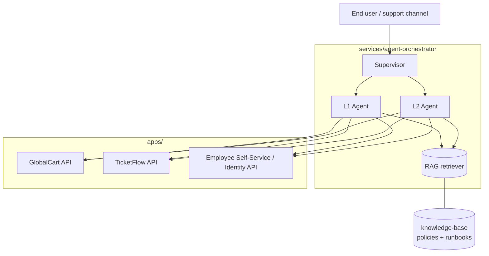

# System Architecture

The Agentic IT Support simulation is a monorepo of independent "business" apps,
a shared knowledge base, and an agent orchestrator that ties them together.

## High-level diagram

## Components

| Component                     | Path                              | Status            |
|-------------------------------|-----------------------------------|-------------------|
| GlobalCart (orders)           | `apps/globalcart`                 | ✅ Implemented    |
| TicketFlow (ITSM)             | `apps/ticketflow`                 | 🚧 Week 1         |
| Employee Self-Service (IAM)   | `apps/employee-self-service`      | 🚧 Week 1         |
| Agent Orchestrator            | `services/agent-orchestrator`     | 🚧 Week 2/3       |
| Knowledge Base (RAG source)   | `knowledge-base`                  | ✅ Seed docs      |

## Design principles

- **Separation of concerns:** each business app owns its own data + API.
- **Tools over direct DB access:** the agent only touches apps through their
  public APIs, mirroring how a real agent integrates with SaaS systems.
- **Grounded reasoning:** decisions are backed by policies/runbooks via RAG.
- **Tiered autonomy:** L1 automates the routine, L2 handles complexity, humans
  own high-authority actions (see the escalation matrix).

## Ports (local dev)

| Service                | Port  |
|------------------------|-------|
| GlobalCart backend     | 8000  |
| GlobalCart frontend    | 5173  |
| TicketFlow backend     | 8001  |
| Employee Self-Service  | 8002  |

See the [ADR](../decisions/ADR-001-tech-stack.md) for the tech-stack rationale.
